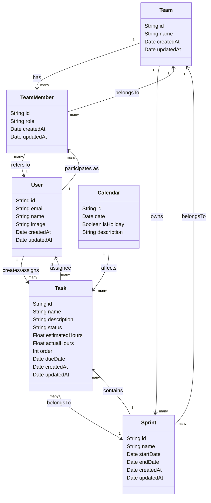

```mermaid
classDiagram
    class Team {
        String id
        String name
        Date createdAt
        Date updatedAt
    }

    class User {
        String id
        String email
        String name
        String image
        Date createdAt
        Date updatedAt
    }

    class TeamMember {
        String id
        String role
        Date createdAt
        Date updatedAt
    }

    class Sprint {
        String id
        String name
        Date startDate
        Date endDate
        Date createdAt
        Date updatedAt
    }

    class Task {
        String id
        String name
        String description
        String status
        Float estimatedHours
        Float actualHours
        Int order
        Date dueDate
        Date createdAt
        Date updatedAt
    }

    class Calendar {
        String id
        Date date
        Boolean isHoliday
        String description
    }

    %% 關聯
    Team "1" --> "many" TeamMember : has
    User "1" --> "many" TeamMember : participates as
    TeamMember "many" --> "1" Team : belongsTo
    TeamMember "many" --> "1" User : refersTo

    Team "1" --> "many" Sprint : owns
    Sprint "many" --> "1" Team : belongsTo

    Sprint "1" --> "many" Task : contains
    Task "many" --> "1" Sprint : belongsTo

    User "1" --> "many" Task : creates/assigns
    Task "many" --> "1" User : assignee

    Calendar "1" --> "many" Task : affects
```
